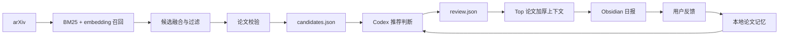

# PaperPilot

 每天替你巡航 arXiv，把论文洪流压缩成一份能读、能选、还能记住你口味的研究雷达。🚀📚

<br clear="left">

PaperPilot 是一个本地优先的每日论文推荐流水线。它先用可复现的 Python 脚本完成抓取、过滤、召回和校验，再把真正需要判断力的部分交给 Codex：哪些值得今天读，为什么值得读，和你的长期研究兴趣有什么关系。

它不是“自动读完所有论文”的许愿池。它更像一位不困、不手滑、还会复盘的论文副驾驶：先把噪声扫掉，再把少数值得认真看的论文送到你面前。最终结果不是一堆 JSON，也不是泛泛摘要，而是一份写进 Obsidian 的中文阅读日报。

## 🧭 为什么用 PaperPilot

| 优势                 | 价值                                                                                            |
| -------------------- | ----------------------------------------------------------------------------------------------- |
| 🏠 本地优先           | 代码、缓存、运行产物、状态都留在本机；远程 embedding 只有显式启用才会调用。                     |
| 🧠 判断力和工程流分离 | Python 负责稳定数据流，Codex 负责推荐判断，避免让 LLM 随手改格式或写坏笔记。                    |
| 🎯 面向真实研究兴趣   | 兴趣画像、负向关键词、历史反馈分开管理，减少“看起来相关但没用”的论文。                          |
| 🔁 不是一次性摘要器   | 阅读动作和反馈会回流到 `state/paper-memory/`，后续推荐会参考你的保存、跳过和负反馈。            |
| 🔍 可审计             | 每天保留 `raw.json`、`candidates.json`、`review.json`、`enriched.json` 和日志，哪里出错能追到。 |
| 📝 Obsidian 原生输出  | 最终只把可读 Markdown 写入 Obsidian，缓存、模型和中间文件不会污染知识库。                       |
| 🛰️ 对 Top 论文更厚    | 必读论文可进一步抓取 arXiv HTML/PDF 片段，生成更接近读前 briefing 的深读区。                    |

## 👩‍🔬 它适合谁

- 每天想跟进 arXiv，但不想被标题列表淹没的研究者。
- 研究兴趣比较明确，需要稳定过滤噪声的人。
- 想把“推荐、阅读、反馈、长期记忆”接成闭环的人。
- 希望 AI 帮忙判断论文价值，但不想把全部流程丢进不可控黑箱的人。

当前默认兴趣聚焦：topological deep learning、higher-order graph learning、graph generation、molecular/RNA AI4Science、graph/foundation models、LLMs for scientific discovery。

## 🛫 工作流



核心边界很简单：

```text
raw.json -> candidates.json -> review.json -> render_daily_note.py -> paper-codex.md
```

`review.json` 由 Codex 写。最终 Markdown 只由 `scripts/render_daily_note.py` 渲染。

## 🚀 快速起飞

第一次上机：

```bash
python -m venv .venv
./.venv/bin/python -m pip install -e ".[dev,embedding]"
```

生成当天候选论文。先扫雷，不下结论：

```bash
scripts/run_candidate_pipeline.sh
```

让 Codex 当论文副驾驶，按固定协议写推荐结果：

```text
读取 AGENT_GUIDE.md 和 config/prompts/run-daily-review.md，基于今天的 candidates.json 生成 review.json，然后渲染 Obsidian 日报。
```

只渲染已有 `review.json`：

```bash
./.venv/bin/python scripts/render_daily_note.py --date "$(date +%F)"
```

## 📬 输出长什么样

日报会写入配置中的 Obsidian PaperFlow 目录，默认结构：

```text
Paper-Daily/YYYY/YYYY-MM-DD-paper-codex.md
```

日报包含：

- 今日概览。
- 必读、值得看、稍后、跳过的分档推荐。
- Top 论文深读区。
- 推荐理由、相关性、可复用想法、局限和待核查问题。
- 可手动填写的 `action::`、`rating::`、`feedback::` 字段。

## 🧩 关键设计

PaperPilot 不追求“把所有论文都读完”。这事听起来很美，实际很像给自己挖坑。它追求更实用的目标：每天稳定选出少数值得你花时间的论文，并解释清楚为什么。

它也不把 AI 放在所有环节。抓取、召回、校验、渲染这些需要稳定性的环节由脚本完成；推荐判断、相关性解释、深读摘要这些需要语义判断的环节才交给 Codex。少一点玄学，多一点可追责。

## 🗂️ 项目结构

```text
config/                  # 路径、兴趣画像、负向过滤、JSON schema、提示词
src/paperpilot/          # 抓取、召回、校验、渲染、反馈同步、记忆更新
scripts/                 # 兼容命令入口，保持很薄
tests/                   # smoke tests
docs/                    # 运行手册和维护计划
AGENT_GUIDE.md           # Codex 每日执行协议
README.md                # 项目介绍
```

更具体的流程说明已经移到 [docs/README.md](docs/README.md)。

本机路径放在被 git 忽略的 `config/local.yaml`。新机器从
`config/local.example.yaml` 复制一份再改路径。

## ✅ 自检

```bash
scripts/check.sh
```

会执行：

- Python 语法检查。
- shell 语法检查。
- Ruff。
- Pytest。
