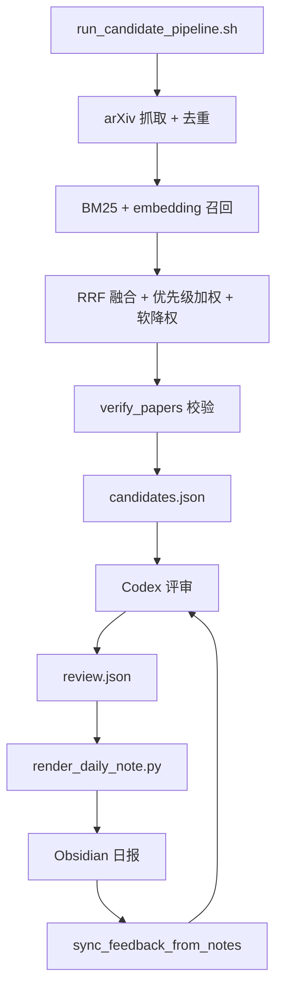

# PaperPilot 设计与维护

本文记录 PaperPilot 的架构、设计决策、指标和维护边界——即「为什么这样建」。
日常运行步骤见 [RUNBOOK.md](RUNBOOK.md)。

## 项目定位

PaperPilot 是一个本地优先的每日论文雷达。主线：

```text
arXiv 抓取 → 本地检索（BM25 + embedding + RRF）→ Codex 评审 → Obsidian 日报 → 反馈闭环
```

代码、依赖、模型缓存、运行产物只跑在项目目录；Obsidian 只接收可读的 Markdown 日报。

## 当前架构

- 实现代码集中在 `src/paperpilot/` 包。
- `scripts/` 是薄 CLI wrapper，经 `scripts/_bootstrap.py` 把 `src/` 加入 `sys.path` 后调用包内 `main()`。
- 稳定模块：

| 模块 | 职责 |
|---|---|
| `paperpilot.paperpilot_fetch_candidates` | arXiv 抓取、过滤、BM25/embedding/RRF、候选生成 |
| `paperpilot.verify_papers` | 论文真实性校验，写回 `verification` 字段 |
| `paperpilot.enrich_top_papers` | Top 论文 HTML/PDF 加厚（可选） |
| `paperpilot.render_daily_note` | 渲染 Obsidian 日报、更新 seen 与论文记忆 |
| `paperpilot.sync_feedback_from_notes` | 从日报回收用户反馈 |
| `paperpilot.update_paper_memory` | 维护 `state/paper-memory/` 长期记忆 |
| `paperpilot.analyze_recommendation_feedback` | 每周推荐偏差报告 |

## 数据流与契约

```text
raw.json → candidates.json →（enriched.json 可选）→ review.json → paper-codex.md
```



固定契约：

- Python 负责确定性数据流；Codex 只产出 `review.json`。
- Markdown 日报由 `render_daily_note` 渲染，不手写。
- Obsidian 只收可读 Markdown；`state/`、`logs/`、`.cache/`、`runs/`、记忆目录都不进 Obsidian。
- `source_basis` 必须标注摘要来源：`title+abstract` / `html` / `pdf` / `html+pdf`。
- 未校验（`verification.status != verified`）的论文不能进 `must_read`。
- Codex 必须把每篇候选恰好归入一个评审分档（去重机制见 [RUNBOOK.md](RUNBOOK.md) 的「已读去重」）。

## 关键设计决策（为什么这样做）

这一节记录决策理由，避免后人重走老路。

- **不单独做传统 rerank。** 本地候选生成只需要便宜召回；Codex 评审层会读 title、abstract、matched_queries 和历史反馈。强 LLM 评审同时替代传统 rerank 和弱 LLM 精筛，少一层 API 依赖和调参。
- **不直接 fork `daily-paper-reader`。** 它可用的部分（arXiv fetch、BM25、embedding、RRF、简单文档生成）可以用更小更清楚的本地脚本实现。直接 fork 会继承：默认远程 embedding endpoint、默认「柏拉图 API」链路、较重的文件命名与流程、非必需的 GitHub Pages 前端。
- **不用「柏拉图 API」。** 指 `daily-paper-reader` 默认推荐的第三方 OpenAI-compatible 网关服务（不是 arXiv API，也不是 embedding 模型本身）。本项目不依赖它：模型能力不匹配，且会引入额外网关依赖。
- **embedding 本地优先。** 默认 `BAAI/bge-m3` 本地 CPU。远程 / API embedding 允许，但必须在配置里显式声明 provider，不能藏在代码默认值里——复现性和可控性优先。
- **Codex 只写 `review.json`。** 最终 Markdown 一律由 `render_daily_note` 渲染，避免每日笔记格式漂移；替换抓取器、embedding 模型或评审模块都不影响渲染层。
- **MVP 只做 arXiv。** OpenReview 更像 deadline 爆发源而非稳定每日源；Zotero、paper-qa 后置。先把单源做稳。
- **双目录隔离。** 代码 / 依赖 / 模型缓存 / 运行产物 / state 留在项目目录；Obsidian 只放可读日报和论文笔记，避免大模型文件污染 OneDrive 同步。

## ARIS 借鉴

PaperPilot 只借鉴适合「轻量每日论文雷达」的 ARIS 工程模式，按模块吸收。它不依赖 Claude Code，也不引入完整 ARIS 工作流。

已借鉴：

| 模式 | PaperPilot 落点 |
|---|---|
| Agent Guide / artifact 契约 | `AGENT_GUIDE.md`，固定 Codex 执行协议，减少上下文漂移 |
| 本地研究记忆 | `state/paper-memory/`：`papers/`、`topics/`、`edges.jsonl`、`query_pack.md` |
| 渐进阅读 | `paperpilot.enrich_top_papers`，Top 论文 HTML → PDF → abstract 分层加厚 |
| 论文校验门 | `paperpilot.verify_papers`，未校验论文不进 `must_read` |
| 反馈驱动优化 | `paperpilot.sync_feedback_from_notes` + 每周推荐偏差报告 |

不引入：

| ARIS 能力 | 原因 |
|---|---|
| 完整研究实体图 | 对每日论文推荐过重 |
| 自动改写配置 | 反馈只应「提建议」，不能静默改策略 |
| Claude-only 工作流 | PaperPilot 必须仅用 Codex 也能跑 |
| 默认多源 | 单 arXiv 更简单、可审计 |
| cross-model 评审 / 实验队列 / 自动写论文 | 与论文雷达目标无关 |

准则：只有当某个 ARIS idea 能**降低每日维护成本**或**堵住真实失败模式**时才加入，否则保持流水线小。

## 配置边界

| 文件 | 内容 |
|---|---|
| `config/paper-daily-config.yaml` | tracked 默认值：路径、检索策略、boost 规则 |
| `config/local.yaml` | gitignored 的机器路径，deep-merge 覆盖默认值（模板见 `local.example.yaml`） |
| `config/interest-profile.yaml` | 正向兴趣方向与 query expansion |
| `config/negative-keywords.yaml` | `hard_exclude`、`soft_downweight`、上下文例外 |

原则：策略词留在 YAML，代码只实现通用匹配逻辑。

## 质量指标

| 指标 | 目标 |
|---|---|
| 每日候选数 | 50-100 |
| 每日必读数 | 1-5 |
| 日报生成成功率 | > 95% |
| 重复推荐率 | 接近 0 |
| 用户反馈覆盖 | 每周 ≥ 10 篇 |
| `not_relevant` 比例 | 逐周下降 |
| 每日人工维护时间 | < 5 分钟 |
| PDF 深读数 | 0-3 篇 / 天 |

## 风险与处理

| 风险 | 处理 |
|---|---|
| 本地 embedding 模型下载慢 | 提前下载 `BAAI/bge-m3`，缓存到 `.cache/` |
| 本地磁盘空间不足 | 预留至少 8-10 GB |
| CPU 跑 `bge-m3` 慢 | 降级 `BAAI/bge-small-en-v1.5` |
| Codex 自动化错过定时 | 日志记录 + 手动补跑 |
| 推荐泛泛而谈 | prompt 强制结合兴趣画像和历史反馈 |
| 无关论文偏多 | 扩充 negative keywords + 反馈降权 |
| 重复论文 | canonical id + normalized title + DOI 去重 |
| Codex 输出 JSON 不稳定 | `review.schema.json` 校验，失败保留日志并停止渲染 |
| Markdown 格式漂移 | 只允许 `render_daily_note` 写日报 |

## Token / quota 估算

主要限制不是 per-call 成本，而是 Codex usage quota 和上下文长度。

- 100 篇 title + abstract ≈ 30k tokens。
- 加兴趣画像、反馈、prompt ≈ 35-45k tokens。
- 控制策略：每日候选压在 50-100；LLM 评审只读 title、abstract、tags、scores；深读限 Top 1-3；反馈摘要压到近 30-90 天。

## 近期工作

1. 每日流程连跑一周。
2. 观察 arXiv rate-limit 稳定性。
3. 检查 `final_top_k` 是否造成评审负担过大。
4. 调检索权重前，先看每周反馈报告。
5. 仅在出现 bug 或规则变更时补测试。

## 后续 roadmap（故意后置）

只有 MVP 稳定后才考虑：

| 扩展 | 触发条件 |
|---|---|
| 多源扩展（OpenReview / Semantic Scholar / OpenAlex） | `verify_papers` 的非 arXiv 校验路径已预留 |
| Zotero 兴趣画像 | Zotero 库足够干净 |
| paper-qa 带引用 PDF 深读 | 需要可追溯的 PDF 问答 |
| GitHub Pages | 需要网页分享 |
| 独立 `Paper-Notes/` 单篇笔记 | 当前深读内联在日报，需要时再拆分 |

## 红线（不要做）

- arXiv-only 流程稳定前不加新源。
- 不让反馈报告自动改写 `config/interest-profile.yaml`——只提建议。
- 不把缓存或模型移进 Obsidian / OneDrive。
- 不让 Codex 直接写最终日报 Markdown。

## 参考

- [ziwenhahaha/daily-paper-reader](https://github.com/ziwenhahaha/daily-paper-reader)
- [TideDra/zotero-arxiv-daily](https://github.com/TideDra/zotero-arxiv-daily)
- [Future-House/paper-qa](https://github.com/Future-House/paper-qa)
- [wanshuiyin/Auto-claude-code-research-in-sleep](https://github.com/wanshuiyin/Auto-claude-code-research-in-sleep)
