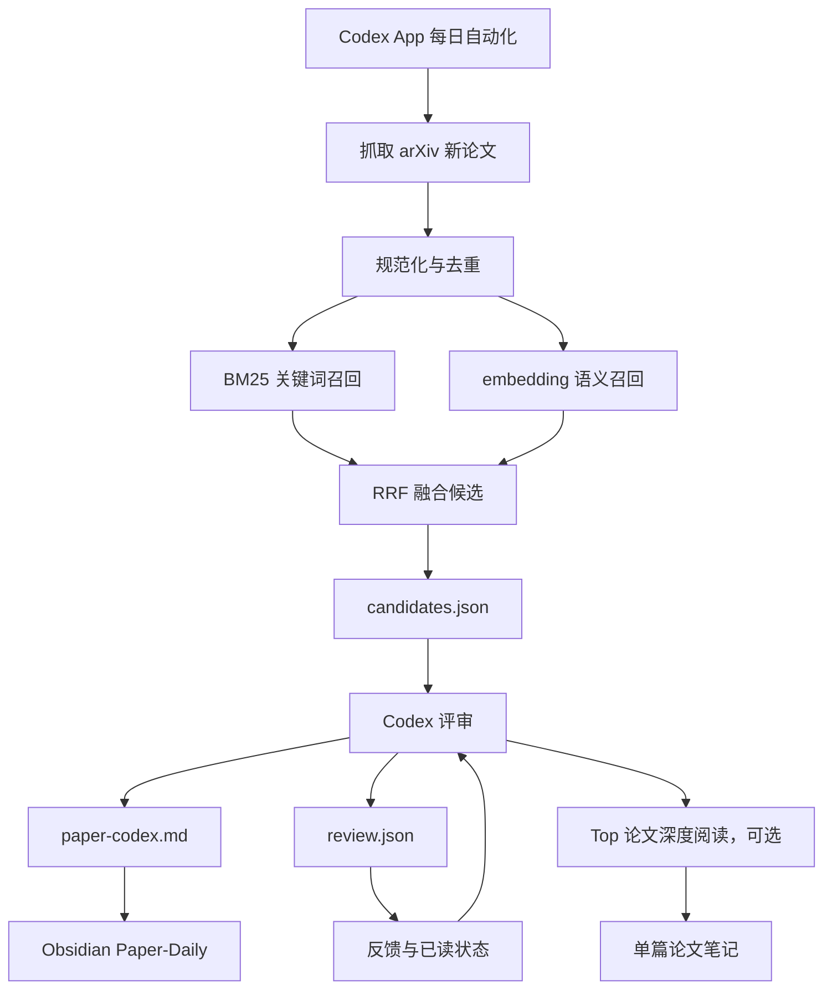

# 每日论文推荐系统改造计划

## 结论

采用**本地 Codex 自动化**作为唯一主线。

系统分工：

| 模块 | 职责 | 推荐实现 |
|---|---|---|
| 候选生成 | 抓取论文、BM25、embedding、RRF | 本地 Python 脚本 |
| 语义召回 | 找到语义相关论文 | 本地 embedding 或显式远程 provider |
| 智能判断 | 推荐/跳过/深读判断 | Codex |
| 笔记输出 | 每日论文日报、单篇笔记 | Obsidian Markdown |
| 反馈闭环 | 记录真实阅读动作，改进后续推荐 | 本地 JSONL + 日报标注 |

不再把 `daily-paper-reader` 视为必须 fork 的底座。它可以作为参考实现，但不应无脑继承其硬编码远程 embedding endpoint、柏拉图 API 默认链路和复杂文件结构。

## 核心原则

1. 默认优先使用本地 embedding；远程 embedding 可以作为快速跑通或备用 provider。
2. Codex 用在判断力环节，不用在 embedding 检索环节。
3. MVP 先只做 arXiv，OpenReview/Zotero/paper-qa 后置。
4. 跳过独立 rerank 是主动设计：强 LLM 评审层本身就是高质量 reranker。
5. 每日自动化必须有明确触发机制，不能只写“AI 自动读取”。
6. 必须记录用户真实反馈，否则系统不会变好。

## 名词说明

“柏拉图 API”在本文中指 `daily-paper-reader` 默认推荐/使用的第三方 OpenAI-compatible 网关服务。它不是 arXiv API，也不是 embedding 模型本身。本文计划不依赖该服务。

## 已核对的 `daily-paper-reader` 事实

核对日期：2026-05-15。

| 项 | 结论 |
|---|---|
| Step 2.2 默认 embedding 参数 | `BAAI/bge-small-en-v1.5` |
| embedding 框架 | `sentence-transformers` |
| 查询侧前缀 | `query: ` |
| 文档侧思路 | 使用标题和摘要构造 embedding 文本 |
| 当前问题 | `src/model_loader.py` 中存在默认远程 embedding endpoint |
| 当前 rerank | 柏拉图 `/rerank` 路径，非必须 |
| 代码风格风险 | 文件名如 `2.2.retrieval_papers_embedding.py`，长期维护不够清爽 |

参考源码：

- [daily-paper-reader/src/2.2.retrieval_papers_embedding.py](https://github.com/ziwenhahaha/daily-paper-reader/blob/main/src/2.2.retrieval_papers_embedding.py)
- [daily-paper-reader/src/model_loader.py](https://github.com/ziwenhahaha/daily-paper-reader/blob/main/src/model_loader.py)
- [daily-paper-reader/src/filter.py](https://github.com/ziwenhahaha/daily-paper-reader/blob/main/src/filter.py)

## 推荐架构



核心文件协议：

```text
raw.json -> candidates.json -> review.json -> render_daily_note.py -> paper-codex.md
```

这个接口要保持简单。Codex 只负责生成结构化 `review.json`，最终 Obsidian Markdown 由 Python 渲染脚本生成，避免每日笔记格式漂移。后续无论替换抓取器、embedding 模型还是 AI 评审模块，都不影响其他层。

日报输出采用两层结构：

| 层级 | 目标 | 数据来源 | 输出位置 |
|---|---|---|---|
| 日报层 | 快速知道今天读什么、为什么读、先读哪几篇 | title + abstract + 检索信号 + 历史反馈 | `Paper-Daily/YYYY/YYYY-MM-DD-paper-codex.md` |
| 重点论文层 | 对 Top 3-5 给出更完整的小型论文笔记 | 仍以候选摘要为基础，后续可接 arXiv HTML/PDF | 同一篇日报的“重点论文深读”区，后续可拆到 `Paper-Notes/` |

当前实现先做“摘要级加厚深读”：内容由 Codex 基于标题、摘要和候选信号生成，不伪装成已经读完整 PDF。后续若接入 arXiv HTML/PDF，再把 `source_basis` 从 `title+abstract` 升级为 `html` 或 `pdf`。

## MVP 范围

第一版只做：

1. arXiv 抓取。
2. 本地 BM25。
3. embedding 召回，默认本地，允许显式远程 provider。
4. RRF 融合。
5. 输出 `candidates.json`。
6. 用 Codex 本地自动化评审。
7. 输出 Obsidian 日报。
8. 记录真实反馈。
9. 对 Top 3-5 必读论文生成加厚摘要区。

第一版不做：

| 暂不做 | 原因 |
|---|---|
| OpenReview 常规每日抓取 | OpenReview 更像 deadline 爆发源，不是稳定每日源 |
| GitHub Pages | 当前主入口是 Obsidian |
| 柏拉图 API | 模型能力不是最佳，且会引入额外网关依赖 |
| 隐式远程 embedding endpoint | 可控性和复现性不如显式 provider |
| 大规模 PDF 深读 | token/quota 压力大，只对 Top 论文后处理 |
| 直接 fork 全量 `daily-paper-reader` | 继承债务太多，收益不明确 |

## 仓库组合策略

| 仓库 | 用法 | 是否进入 MVP |
|---|---|---:|
| [ziwenhahaha/daily-paper-reader](https://github.com/ziwenhahaha/daily-paper-reader) | 参考其抓取、BM25、embedding、RRF 流程 | 参考，不直接 fork |
| [TideDra/zotero-arxiv-daily](https://github.com/TideDra/zotero-arxiv-daily) | 参考 Zotero 兴趣画像 | 后置 |
| [Future-House/paper-qa](https://github.com/Future-House/paper-qa) | Top 论文 PDF RAG 深读 | 后置 |

## 为什么不直接 fork `daily-paper-reader`

`daily-paper-reader` 的可用部分主要是：

- arXiv fetch。
- BM25。
- embedding 召回。
- RRF。
- 简单文档生成。

这些功能可以用更小、更清楚的本地脚本实现。直接 fork 的代价：

| 问题 | 影响 |
|---|---|
| 默认远程 embedding endpoint | 依赖外部服务，复现性和可控性弱 |
| 默认柏拉图 API 链路 | 与目标模型能力不匹配 |
| 文件命名和流程较重 | 长期维护成本高 |
| 前端/GitHub Pages 不是 MVP 必需 | 会干扰核心目标 |

判断：**先写干净候选生成器，必要时再按函数级别借鉴 `daily-paper-reader`。**

## 本地自动化触发机制

### 首选：Codex App 每日自动化

MVP 使用 Codex App 的 recurring automation。代码和模型放在 `/Users/hym/PycharmProjects/PaperPilot`，最终 Markdown 报告输出到当前 Obsidian 库。

自动化任务只做一件事：执行 PaperPilot 日报流水线。

任务提示词应固定为：

```text
在 /Users/hym/PycharmProjects/PaperPilot 中运行每日论文推荐流程：
1. 先运行 scripts/sync_feedback_from_notes.py，从 Obsidian 日报同步用户反馈到 state/paper-feedback.jsonl。
2. 运行 scripts/run_daily_paperpilot.sh 生成今天的 candidates.json。
3. 读取 runs/YYYY-MM-DD/candidates.json、config/interest-profile.yaml、config/negative-keywords.yaml、state/paper-feedback.jsonl。
4. 按 config/review.schema.json 生成 runs/YYYY-MM-DD/review.json。
5. 运行 scripts/render_daily_note.py，把 review.json 渲染到 Obsidian 的 Paper-Daily/YYYY/YYYY-MM-DD-paper-codex.md。
6. embedding provider 必须在配置里显式声明；不调用柏拉图 API。
7. 保留日志和中间文件，失败时说明失败点。
```

触发频率：

```text
每天 08:30 本地时间
```

优点：

- 只依赖 Codex，不依赖其他 agent 客户端。
- 不需要 GitHub Actions。
- 代码、依赖、模型不会污染 Obsidian / OneDrive。
- Obsidian 只保留最终可读报告和论文笔记。
- 与后续手动追问在同一工作环境中。

### 备用：本地脚本 + Codex 手动/定时调用

如果 Codex App 自动化调度不稳定，可以保留一个确定性的 shell 脚本，只负责非 AI 部分：

```bash
#!/usr/bin/env zsh
set -euo pipefail

PROJECT="/Users/hym/PycharmProjects/PaperPilot"
OUTPUT="/Users/hym/Library/CloudStorage/OneDrive-std.uestc.edu.cn/Obsidian/3-PaperFlow"
TODAY="$(date +%F)"

cd "$PROJECT"
mkdir -p "runs/$TODAY" "logs" "state"

python scripts/paperpilot_fetch_candidates.py \
  --config config/paper-daily-config.yaml \
  --output "runs/$TODAY/candidates.json" \
  --obsidian-output "$OUTPUT"
```

然后由 Codex 读取 `candidates.json` 完成评审，`render_daily_note.py` 负责写入 Obsidian。

Codex 使用固定文件协议：

```text
candidates.json -> review.json -> render_daily_note.py -> paper-codex.md
```

## 目录结构

采用双目录结构：项目代码和模型缓存放在 PyCharmProjects，最终报告放在 Obsidian。

项目目录：

```text
/Users/hym/PycharmProjects/PaperPilot/
├── config/
│   ├── paper-daily-config.yaml
│   ├── interest-profile.yaml
│   ├── negative-keywords.yaml
│   ├── review.schema.json
│   └── prompts/
│       ├── run-daily-review.md
│       └── deep-read-paper.md
├── scripts/
│   ├── paperpilot_fetch_candidates.py
│   ├── render_daily_note.py
│   ├── sync_feedback_from_notes.py
│   └── run_daily_paperpilot.sh
├── src/
├── runs/
│   └── 2026-05-15/
│       ├── raw.json
│       ├── candidates.json
│       └── review.json
├── state/
│   ├── seen-papers.txt
│   └── paper-feedback.jsonl
├── logs/
├── .cache/
│   └── huggingface/
├── .venv/
├── pyproject.toml
└── .gitignore
```

Obsidian 输出目录：

```text
/Users/hym/Library/CloudStorage/OneDrive-std.uestc.edu.cn/Obsidian/3-PaperFlow/
├── Paper-Daily/
│   └── 2026/
│       └── 2026-05-15-paper-codex.md
└── Paper-Notes/
```

`.venv/`、`.cache/`、`runs/`、`state/`、`logs/` 不进入 Obsidian，也不建议提交 git。PyCharm 中应把 `.cache/` 标为 excluded，避免索引模型文件。

## 候选生成器设计

### 输入

```yaml
arxiv:
  categories:
    - cs.AI
    - cs.LG
    - cs.CL
    - cs.CV
    - stat.ML
    - q-bio.BM
    - q-bio.MN
    - q-bio.QM
  days_window: 3
  max_results: 300

interest:
  profile_source: /Users/hym/Downloads/CV-Yiming.pdf
  include:
    primary:
      - topological deep learning
      - higher-order graph neural networks
      - higher-order graph representation learning
      - simplicial complexes and cell complexes
      - combinatorial complexes
      - hypergraph neural networks
      - graph generation with higher-order topology
      - topology-aware diffusion models for graphs
      - molecular graph generation
      - molecular foundation models
      - topology-aware molecular representation learning
      - RNA representation learning
      - RNA structure and dynamics modeling
      - AI4Science for molecules, biomolecules, and RNA
    secondary:
      - large language models for scientific discovery
      - foundation models for science
      - scientific foundation models
      - graph foundation models
      - generative models for graphs and molecules
      - geometric deep learning
      - graph representation learning
      - network science with machine learning
      - influence maximization in complex networks
      - node ranking and key player identification
      - decentralized graph learning
      - autonomous research agents for AI4Science
    query_expansion:
      - topology-aware generative model
      - higher-order topology for graph learning
      - cell complex neural network
      - simplicial neural network
      - ring-aware molecular generation
      - coarse-to-fine graph diffusion
      - contact map RNA representation learning
      - molecular language model
      - LLM for scientific discovery
      - graph transformer for molecules
  exclude:
    - quantum computing
    - quantum information
    - quantum machine learning
    - quantum communication
    - quantum cryptography
    - quantum steganalysis
    - quantum protocol
    - quantum algorithms
    - quantum networks
    - medical diagnosis only
    - pure benchmark leaderboard
    - finance trading
    - blockchain
    - recommendation systems without graph or science relevance

retrieval:
  category_policy:
    cs.CL: only_keep_if_llm_or_foundation_model_relevant_to_science_or_graphs
    cs.CV: only_keep_if_geometric_3d_scientific_or_molecular_relevant
    q-bio: keep_if_ai4science_or_representation_learning_relevant
  bm25_top_k: 80
  embedding_top_k: 80
  final_top_k: 100
  priority_boost:
    topological_deep_learning: 1.5
    higher_order_graphs: 1.5
    molecular_or_rna_ai4science: 1.4
    foundation_models_for_science: 1.25
    generic_llm_without_science_or_graph: 0.6
    quantum_related: 0.0
    quantum_chemistry_with_molecular_ml: 0.7
```

这份兴趣配置来自 CV 中的研究主线：Topological Deep Learning、higher-order graph structures、graph representation learning、foundation models、generative models、AI4Science、molecular/RNA applications、network science。Quantum computing / quantum information / quantum protocol 类内容只作为历史论文背景出现，不进入当前推荐范围。Quantum chemistry 不硬删：只有和 molecular ML、AI4Science、molecular generation 明确相关时才允许低权重保留，避免误伤分子机器学习论文。

### 输出 `candidates.json`

```json
{
  "date": "2026-05-15",
  "source": "arxiv",
  "candidates": [
    {
      "canonical_id": "arxiv:2605.12345",
      "source_id": "2605.12345v2",
      "title": "...",
      "abstract": "...",
      "authors": ["..."],
      "published": "2026-05-15",
      "url": "https://arxiv.org/abs/2605.12345",
      "pdf_url": "https://arxiv.org/pdf/2605.12345",
      "categories": ["cs.LG"],
      "matched_queries": ["..."],
      "bm25_score": 12.3,
      "embedding_score": 0.72,
      "rrf_score": 0.038
    }
  ]
}
```

## Embedding 方案

默认优先本地 embedding。你不在意 `intent_queries` 和研究方向是否暴露，所以远程 embedding 不再因为隐私被排除；但它必须作为显式 provider 出现，不能隐藏在代码默认值里。

默认配置：

```bash
EMBED_PROVIDER=local
EMBED_MODEL=BAAI/bge-m3
EMBED_DEVICE=cpu
EMBED_BATCH_SIZE=8
BGE_QUERY_PREFIX=""
BGE_DOCUMENT_PREFIX=""
BGE_NORMALIZE_EMBEDDINGS=true
HF_HOME=/Users/hym/PycharmProjects/PaperPilot/.cache/huggingface
TRANSFORMERS_CACHE=/Users/hym/PycharmProjects/PaperPilot/.cache/huggingface
```

`BAAI/bge-m3` 作为正式默认模型。预计模型缓存约 2.2-4.3 GB，连同 Python 依赖建议预留 8-10 GB。模型缓存放在 `/Users/hym/PycharmProjects/PaperPilot/.cache/huggingface`，不要放进 Obsidian / OneDrive 目录，避免同步大量模型文件。BGE-M3 不沿用 E5 的 `query:` / `passage:` 前缀，默认空前缀并使用归一化向量做余弦相似度。

低资源 fallback：

```bash
EMBED_PROVIDER=local
EMBED_MODEL=BAAI/bge-small-en-v1.5
EMBED_DEVICE=cpu
EMBED_BATCH_SIZE=16
```

快速跑通或远程服务模式：

```bash
EMBED_PROVIDER=remote
EMBED_MODEL=BAAI/bge-small-en-v1.5
EMBED_BASE_URL=https://example.com/embed
EMBED_API_KEY=
```

API embedding 模式：

```bash
EMBED_PROVIDER=api
EMBED_MODEL=text-embedding-3-large
EMBED_BASE_URL=https://api.openai.com/v1
EMBED_API_KEY=...
```

推荐模型：

| 模型 | 优点 | 用法 |
|---|---|---|
| `BAAI/bge-m3` | 中英文、多领域、质量更稳 | 默认推荐 |
| `intfloat/multilingual-e5-large` | 多语言语义检索强 | 备选 |
| `BAAI/bge-small-en-v1.5` | 小、快、CPU 友好 | 低资源 fallback |

Provider 规则：

1. 禁止硬编码默认远程 embedding endpoint。
2. 远程 embedding 可以使用，但必须显式配置 `EMBED_PROVIDER=remote` 或 `EMBED_PROVIDER=api`。
3. 日志必须打印 provider 和模型名。
4. 如果远程服务失败，允许回退本地模型，但日志必须明确记录。
5. 本地模型统一缓存到 `/Users/hym/PycharmProjects/PaperPilot/.cache/`，不要写入 `3-PaperFlow/`。
6. 使用 `BAAI/bge-m3` 时，`query_prefix` 和 `document_prefix` 默认为空字符串。

## 召回与排序

### BM25

作用：

- 保证关键词强匹配。
- 对术语、缩写、具体方法名敏感。

### Embedding

作用：

- 捕捉语义相近但词面不同的论文。
- 弥补关键词召回漏检。

### RRF

RRF 负责融合 BM25 和 embedding 排名。

公式只需要简单稳定：

```text
score = sum(1 / (k + rank_i))
```

默认：

```yaml
rrf:
  k: 60
```

### 不单独做传统 rerank

这是主动设计，不是偷懒。

理由：

1. 本地候选生成只需要便宜召回。
2. Codex 评审层会读取 title、abstract、matched queries 和历史反馈。
3. 强 LLM 评审同时替代传统 rerank 和弱 LLM 精筛。
4. 这样减少一层 API 依赖，也减少调参复杂度。

## 去重规则

必须在候选生成阶段做 canonical id。

规则：

| 情况 | 处理 |
|---|---|
| arXiv `2605.12345v1` / `v2` | 去掉版本号，统一为 `arxiv:2605.12345` |
| arXiv 与 OpenReview 同篇 | 优先 DOI，其次 normalized title |
| 标题大小写/标点差异 | normalized title 匹配 |
| PDF URL 不同但 DOI 相同 | 视为同篇 |
| 同一论文多源出现 | 合并 sources，保留所有链接 |

建议字段：

```json
{
  "canonical_id": "arxiv:2605.12345",
  "source_ids": ["arxiv:2605.12345v2", "openreview:xxxx"],
  "dedupe_keys": {
    "arxiv_id": "2605.12345",
    "doi": "...",
    "normalized_title": "..."
  }
}
```

## Codex 评审层

输入：

- `candidates.json`
- `interest-profile.yaml`
- `negative-keywords.yaml`
- `state/paper-feedback.jsonl`
- `config/review.schema.json`
- 最近 7-30 天日报摘要
- 当前研究项目简述

输出：

- Codex 只输出 `runs/YYYY-MM-DD/review.json`
- `scripts/render_daily_note.py` 负责输出 `Obsidian/3-PaperFlow/Paper-Daily/YYYY/YYYY-MM-DD-paper-codex.md`

`review.json` 必须通过 `config/review.schema.json` 校验。不要让 Codex 直接生成最终 Markdown 作为唯一产物。

最小 schema 字段：

```json
{
  "date": "YYYY-MM-DD",
  "summary": "string",
  "must_read": [],
  "worth_reading": [],
  "later": [],
  "skip": [],
  "trend_observations": [],
  "tomorrow_followups": []
}
```

加厚输出字段：

```json
{
  "deep_dives": [
    {
      "canonical_id": "arxiv:2605.12345",
      "title": "string",
      "source_basis": "title+abstract",
      "tldr": "string",
      "summary_zh": "string",
      "problem": "string",
      "method": "string",
      "core_innovations": ["string"],
      "evidence": ["string"],
      "limitations": ["string"],
      "relevance_to_me": "string",
      "reusable_ideas": ["string"],
      "questions_to_check": ["string"],
      "reading_priority": "string"
    }
  ]
}
```

`deep_dives` 默认来自 `must_read` 的 Top 3-5。当前阶段必须明确写 `source_basis: "title+abstract"`，避免把摘要级判断包装成 PDF 深读结论。

评审分档：

| 档位 | 含义 |
|---|---|
| 必读 | 今天值得投入时间阅读 |
| 值得看 | 相关，但不一定今天读 |
| 稍后 | 可能有价值，放入 backlog |
| 跳过 | 当前不值得读 |

每篇论文必须输出：

1. 一句话结论。
2. 推荐档位。
3. 推荐或跳过理由。
4. 与当前研究方向的关系。
5. 可能可复用的 idea。
6. 不确定点。
7. 建议动作。

重点论文还必须输出：

1. `TL;DR`。
2. 中文摘要。
3. 研究问题。
4. 方法拆解。
5. 核心创新。
6. 实验与证据。
7. 局限性。
8. 与当前研究的关系。
9. 可复用 idea。
10. 后续需要检查的问题。

禁止输出：

1. 只复述 abstract。
2. 泛泛说“很有启发”。
3. 把模型推断写成论文事实。
4. 忽略用户负反馈。

## Markdown 渲染层

`scripts/render_daily_note.py` 是唯一写 Obsidian 日报的脚本。

输入：

- `runs/YYYY-MM-DD/review.json`
- `runs/YYYY-MM-DD/candidates.json`
- `config/paper-daily-config.yaml`

输出：

- `/Users/hym/Library/CloudStorage/OneDrive-std.uestc.edu.cn/Obsidian/3-PaperFlow/Paper-Daily/YYYY/YYYY-MM-DD-paper-codex.md`

职责：

1. 固定 Obsidian frontmatter。
2. 固定章节顺序和字段名。
3. 保留 `action:: pending` 和 `feedback:: pending`，方便后续人工标注。
4. 避免 Codex 每天生成不同 Markdown 风格。
5. 使用 Obsidian callout、总览表和分档表提高可读性。
6. 对 `deep_dives` 渲染更完整的重点论文区。

## Obsidian 日报格式

路径：

```text
3-PaperFlow/Paper-Daily/YYYY/YYYY-MM-DD-paper-codex.md
```

模板：

```markdown
---
date: YYYY-MM-DD
type: paper-daily
source: arxiv
runner: codex
tags:
  - paper-daily
  - PaperPilot
---

# YYYY-MM-DD Paper Daily

> [!abstract] 今日结论
> 今日整体判断。

## 快速导航

| 优先级 | 论文 | 方向 | 建议动作 |
|---|---|---|---|

## 先读这几篇

1. Paper A
2. Paper B
3. Paper C

## 重点论文深读

### Paper Title

> [!tip] TL;DR
> ...

> [!note] 中文摘要
> ...

> [!example] 方法拆解
> ...

> [!warning] 局限与待核查
> ...

## 分档推荐

## 今日必读

### Paper Title

- source:: arxiv
- canonical_id:: arxiv:2605.12345
- url:: https://arxiv.org/abs/2605.12345
- decision:: 必读
- feedback:: pending
- action:: pending

> [!tip] 一句话结论
> ...

> [!note] 推荐理由
> ...

## 值得看

## 稍后

## 跳过

## 今日趋势

## 明日跟进
```

## 反馈闭环

只靠 `seen-papers.txt` 不够。系统必须记录用户真实行为。

新增文件：

```text
/Users/hym/PycharmProjects/PaperPilot/state/paper-feedback.jsonl
```

每行一条：

```json
{
  "date": "2026-05-15",
  "canonical_id": "arxiv:2605.12345",
  "title": "...",
  "system_decision": "必读",
  "user_action": "read",
  "user_rating": 4,
  "user_reason": "和当前项目强相关",
  "tags": ["GNN", "optimization"]
}
```

`user_action` 枚举：

| 值 | 含义 |
|---|---|
| `read` | 实际读了 |
| `save` | 保存，准备以后读 |
| `skip` | 明确跳过 |
| `not_relevant` | 推荐错了 |
| `later` | 相关但暂不读 |

反馈使用方式：

1. 下次评审 prompt 读取最近 30-90 天反馈。
2. 对 `read/save` 的主题加权。
3. 对 `not_relevant/skip` 的模式降权。
4. 每周生成一次“推荐偏差总结”。

这样指标“无关论文比例降低”才有实际依据。

反馈同步脚本：

```text
scripts/sync_feedback_from_notes.py
```

职责：

1. 扫描 Obsidian 的 `Paper-Daily/YYYY/*.md`。
2. 读取每篇论文块里的 `canonical_id::`、`action::`、`feedback::`。
3. 将非 `pending` 的用户动作同步到 `state/paper-feedback.jsonl`。
4. 按 `canonical_id + date` 去重，重复运行不产生重复反馈。
5. 不修改 Obsidian 日报内容，只读取。

## Token 和 quota 估算

本路线主要限制不是 per-call API 成本，而是 Codex 会员 usage quota 和上下文长度。

粗估：

| 任务 | 输入规模 |
|---|---:|
| 100 篇 title + abstract | 约 30k tokens |
| 加兴趣画像、反馈、prompt | 约 35k-45k tokens |
| 深读 1 篇 PDF | 约 20k-100k tokens |
| 每天深读 3 篇 PDF | 可能超过日常 quota |

控制策略：

1. 每日候选控制在 50-100 篇。
2. LLM 评审只读 title、abstract、tags、scores。
3. 只对 Top 1-3 篇做 PDF 深读。
4. 反馈摘要压缩到最近 30-90 天。
5. 每周再做一次趋势总结，不在每日任务里塞太多历史。

## 自动化启用门槛

不要一上来就创建每日自动化。先手动跑通 3 次：

1. `scripts/run_daily_paperpilot.sh` 能稳定生成 `candidates.json`。
2. Codex 能按 `config/review.schema.json` 生成合法 `review.json`。
3. `scripts/render_daily_note.py` 能稳定写入 Obsidian 日报。
4. `scripts/sync_feedback_from_notes.py` 重复运行不会产生重复反馈。
5. 三次运行都没有路径错误、schema 错误、重复推荐异常。

满足以上条件后，再创建 Codex App recurring automation。

## 分阶段实施计划

### Phase 0：固定 Codex 自动化接口

目标：先把“每天怎么跑”定义清楚。

动作：

1. 确定主 runner：Codex App recurring automation。
2. 固定自动化提示词和工作目录。
3. 在 `/Users/hym/PycharmProjects/PaperPilot` 新建 `scripts/run_daily_paperpilot.sh`，只负责候选生成的确定性部分。
4. 新建 `config/prompts/run-daily-review.md`，作为 Codex 评审规范。
5. 新建 `config/review.schema.json`。
6. 新建 `runs/`、`state/` 和 `logs/`。
7. 由 Codex App 每天触发；cron/launchd 仅作为候选生成备用。

验收：

- 手动执行脚本能完整生成一篇日报。
- 定时任务日志可追踪。
- 失败时保留中间文件。
- 自动化启用前必须满足上一节的 3 次手动运行门槛。

### Phase 1：干净候选生成器 + 本地 embedding

目标：合并原计划的候选生成和 embedding provider 改造，第一天就把 embedding provider 做成显式配置。

动作：

1. 在 `/Users/hym/PycharmProjects/PaperPilot` 中新建干净候选生成器。
2. 抓取 arXiv 最近 N 天论文。
3. 规范化字段。
4. 实现 canonical id 去重。
5. 实现 BM25 召回。
6. 实现 embedding provider，默认本地，允许显式远程/API。
7. 实现 RRF 融合。
8. 输出 `candidates.json`。

推荐依赖：

```text
arxiv
rank-bm25
sentence-transformers
numpy
pyyaml
jsonschema
```

验收：

- 不配置柏拉图 API。
- 不请求任何硬编码远程 embedding endpoint。
- CPU 环境可跑。
- 生成 50-100 篇候选。
- 日志显示 embedding provider 和模型名。

### Phase 2：Codex 评审和 Obsidian 输出

目标：把候选论文变成真正可读的日报，并对 Top 3-5 做摘要级加厚解读。

动作：

1. 设计 `run-daily-review.md`。
2. 让 Codex 读取 `candidates.json`。
3. 让 Codex 按 `config/review.schema.json` 输出 `review.json`。
4. 在 `review.json` 中加入 `deep_dives`，覆盖 Top 3-5 必读论文。
5. 用 `scripts/render_daily_note.py` 渲染美化版 `paper-codex.md`。
6. 写入 `Paper-Daily/YYYY/`。
7. 更新 `state/seen-papers.txt`。

验收：

- 推荐理由具体。
- 必读数量 1-5。
- Top 3-5 有 `TL;DR`、中文摘要、方法拆解、创新点、证据、局限和待核查问题。
- 跳过理由明确。
- `review.json` 通过 schema 校验。
- Markdown 在 Obsidian 中可直接阅读。
- 日报顶部有快速导航表和先读列表。

### Phase 3：反馈闭环

目标：让系统根据真实阅读行为变好。

动作：

1. 在日报中加入 `feedback:: pending`。
2. 新建 `scripts/sync_feedback_from_notes.py` 读取日报中的反馈字段。
3. 生成或更新 `state/paper-feedback.jsonl`。
4. 每次评审前加载近期反馈。
5. 每周总结误判模式。

验收：

- 用户标注 `read/save/skip/not_relevant/later` 后可被下次任务读取。
- 下次日报能引用历史反馈。
- 能统计推荐命中率。

### Phase 4：Top 论文 HTML/PDF 深读

目标：在摘要级加厚解读稳定后，只对高价值论文做正文级深读。

动作：

1. 从“必读”中选 Top 1-3。
2. 下载 PDF 或读取 arXiv HTML。
3. Codex 生成单篇论文笔记。
4. 输出到 `3-PaperFlow/Paper-Notes/`。
5. 在日报中链接对应单篇笔记。

单篇笔记结构：

```markdown
# Paper Title

## 一句话结论

## 研究问题

## 方法

## 关键创新

## 实验与证据

## 局限

## 和我的研究的关系

## 可复用 idea

## 后续问题
```

验收：

- 深读笔记区分论文事实和 AI 判断。
- 不确定内容明确标注。
- 只深读真正高价值论文。
- `source_basis` 从 `title+abstract` 升级为 `html`、`pdf` 或 `html+pdf`。

### Phase 5：后置扩展

只有 MVP 稳定后再加：

| 扩展 | 条件 |
|---|---|
| OpenReview | 需要关注特定会议 deadline |
| Zotero 兴趣画像 | Zotero 库足够干净 |
| paper-qa | 需要带引用的 PDF 问答 |
| GitHub Pages | 需要网页分享 |
| 多源 AI 雷达 | 需要 GitHub/HF/HN 等非论文信号 |

## 质量指标

| 指标 | 目标 |
|---|---|
| 每日候选数量 | 50-100 |
| 每日必读数量 | 1-5 |
| 日报生成成功率 | > 95% |
| 重复推荐率 | 接近 0 |
| 用户反馈覆盖率 | 每周至少标注 10 篇 |
| `not_relevant` 比例 | 逐周下降 |
| 每日人工维护时间 | < 5 分钟 |
| PDF 深读数量 | 0-3 篇/天 |

## 风险与处理

| 风险 | 处理 |
|---|---|
| 本地 embedding 模型下载慢 | 提前下载 `BAAI/bge-m3`，缓存到 `/Users/hym/PycharmProjects/PaperPilot/.cache/` |
| 本地磁盘空间不足 | 先释放至少 8-10 GB，再下载模型和依赖 |
| CPU 跑 `bge-m3` 慢 | 降级 `bge-small-en-v1.5` |
| Codex 自动化错过定时 | 日志记录 + 补跑脚本 |
| 本地机器状态影响任务 | 保留中间文件，支持手动补跑 |
| 推荐泛泛而谈 | prompt 强制结合兴趣画像和历史反馈 |
| 无关论文多 | 增加 negative keywords 和反馈降权 |
| 重复论文 | canonical id + normalized title + DOI 去重 |
| 深读消耗过高 | 限制 Top 1-3，默认不深读 |
| 反馈没人填 | 日报里用简单字段，不做复杂 UI |
| Codex 输出 JSON 不稳定 | 用 `review.schema.json` 校验，失败则保留错误日志并停止渲染 |
| Markdown 格式漂移 | 只允许 `render_daily_note.py` 写 Markdown |

## 立即下一步

1. 确认 MVP 只抓 arXiv。
2. 清理磁盘，预留至少 8-10 GB 给 Python 依赖和 `BAAI/bge-m3` 缓存。
3. 新建 `/Users/hym/PycharmProjects/PaperPilot`。
4. 新建 `scripts/run_daily_paperpilot.sh`。
5. 新建本地候选生成脚本。
6. 新建 `config/review.schema.json`。
7. 新建 `scripts/render_daily_note.py`。
8. 新建 `scripts/sync_feedback_from_notes.py`。
9. 新建 Codex 评审 prompt。
10. 手动跑通 3 次端到端流程，确认 `review.json` 稳定且报告写入 Obsidian。
11. 创建 Codex App 每日自动化。

## 参考链接

- [ziwenhahaha/daily-paper-reader](https://github.com/ziwenhahaha/daily-paper-reader)
- [TideDra/zotero-arxiv-daily](https://github.com/TideDra/zotero-arxiv-daily)
- [Future-House/paper-qa](https://github.com/Future-House/paper-qa)
